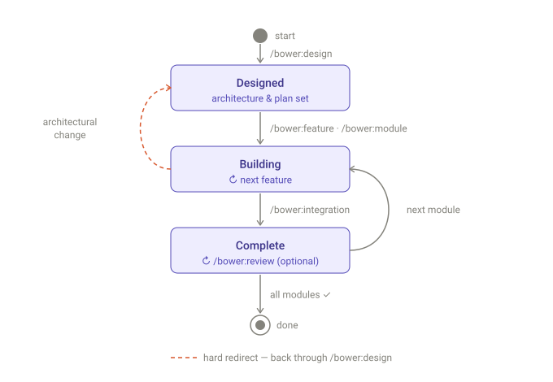

# Bower Framework v0.30

A lightweight AI-assisted development pattern for research software engineering.

> **Beta.** Bower is in active development and already building real tools. Feedback is welcome: open an issue on this repo, or email **matthew.bettinson@anu.edu.au**.

## What is Bower?

Bower is a set of files you drop into a project that uses [Claude Code](https://claude.com/claude-code). It installs nothing, runs no server, and needs no account beyond your existing Claude Code setup. What it adds is structure for planning, documenting and implementing software where an AI agent does much of the work:

- **Planning before building.** Design and document before implementing, with a confirmation gate before code.
- **Living documentation.** Documents describe current state, not history; git is the change log.
- **Docs that don’t rot.** Every document has one writer, a word budget, and an end state. A fact lives in exactly one place, anything derivable is recomputed instead of stored, and a finished feature’s notes compress to the evidence that it passed. Documents that only ever grow stop being read — by agents first.
- **Modules.** Logical groupings that persist as system boundaries. Changing them is gated, never ad-hoc.
- **Agent-efficient context.** One small always-loaded router; specs, schemas and ADRs are pulled in only when a command needs them, and ADRs are selected by facet rather than read wholesale.
- **A project state viewer.** A zero-dependency local viewer renders the whole project and reports drift: forty-odd checks that compare documents against each other and against the files on disk.

The pattern borrows planning discipline from [SpecKit](https://github.com/github/spec-kit) and living documentation from [OpenSpec](https://github.com/Fission-AI/OpenSpec), tuned for small research teams and the full prototype-to-infrastructure lifecycle. Claude Code is the only supported runtime today; adapters for other coding agents (including OpenAI Codex) are tracked on the roadmap.

## How it works

You describe a change. The agent reads the project’s design docs, proposes a plan with acceptance criteria, and waits for your sign-off before touching anything. Every command works this way: the agent recommends, you decide.



States are where a project (or module) sits; each arrow is labelled with the command that moves it. The dashed round trip is optional: a complete module can go through review and come back reviewed, but nothing about completion waits on it.

- **`/b-design`** is the entry point for new projects, and for any change that shifts architecture, decisions, scope or module structure. Six stages: a read-only analyst subagent produces a change brief, then problem framing, decisions (recorded as ADRs), architecture, module and feature plans, and scaffolding, each behind a confirmation gate. Stages with nothing to do say so in one line and move on, so the ceremony only fires where there is actual work.
- **`/b-feature`** is the everyday command: add, modify or remove within existing architecture. One gate before code, then a fresh subagent implements against the approved plan and reports back for reconciliation. If the change turns out to be architectural, it redirects to `/b-design`. That redirect is the one arrow in the diagram that runs backwards, and it is a hard rule: structural change never happens on the fly.
- **`/b-module`** builds a small, well-specified module in one gated pass; **`/b-integration`** writes the module-boundary test that flips a module to complete.
- **`/b-review`** is the optional side branch: a fresh-eyes review of a finished module, which becomes a state the module carries rather than a pass that happens and is forgotten (see *Reviewing a module*).
- **`/b-recap`** re-orients you in a fresh session without changing anything; **`/b-analysis`** previews what `/b-design` would do, read-only.

## Getting started

Clone this repo somewhere scratch and run the scaffold script against your project (new or existing):

```bash
git clone https://github.com/anu-hdrh/bower-framework /tmp/bower
/tmp/bower/scripts/scaffold.sh /path/to/your-project
# Windows PowerShell: \tmp\bower\scripts\scaffold.ps1 C:\path\to\your-project
rm -rf /tmp/bower
```

This copies `_bower/` (the framework guidance; treat it as read-only) and `.claude/` (the `/b-*` commands and three subagents) into your project, and seeds a `CLAUDE.md` if you don’t already have one. An existing `CLAUDE.md` is left alone; the only line Bower needs in it is `@_bower/framework.md`. If you’d rather copy the files by hand, the script is short and readable; do what it does.

Then:

1. **Tell Claude about your code standards.** Open `CLAUDE.md` and fill in the *Project-Specific Code Standards* section: language, formatter, test runner, anything you’d tell a new collaborator. Two or three bullets is enough to start. Claude Code reads this file automatically every session; the slash commands appear as soon as `.claude/commands/` exists.

2. **Start a session and design:**

   ```bash
   cd your-project
   claude
   ```

   ```
   /b-design I want to build <one-sentence description>
   ```

After the first design pass, day-to-day work is `/b-feature` (or `/b-module` for a whole module), with `/b-recap` to find your feet when you come back to the project later.

To move an existing Bower project to a newer framework version, don’t re-run the scaffold by hand; run `/b-upgrade` in the project (see *Upgrading*).

## Adopting an existing codebase

If the project already has substantial code that was never designed with Bower, start with `/b-adopt` instead. Where `/b-design` frames a project forward from intent, `/b-adopt` works backward from the code: it surveys the repo, proposes module boundaries from the data concerns it sees, and reconstructs the orienting docs, gating every group of content past you for confirmation or correction. It writes only under `docs/`; your code is never touched.

One preparation step improves the result more than anything else: before running it, put copies of any existing design material (product briefs, architecture notes, RFCs, decision rationale) in `docs/reference/`. The command treats these as evidence and cites them, which turns hedged inference into grounded framing.

Cross-cutting choices it can’t explain go into an adoption ledger, which you drain in the course of normal work: capture the intent behind a choice you’re keeping (`/b-adr`), remediate a mistaken one (`/b-feature`, or `/b-design` when architectural), or dismiss it. Adopted features start at 🚧, meaning present in the code but not yet verified against agreed criteria; each earns its ✓ as it is next touched.

## Reviewing a module

A feature-at-a-time build cannot see the things that only exist once a module is whole: whether the tests cover the *interactions* between features, whether features built weeks apart answer the same question the same way, whether an accepted ADR has quietly drifted from the code. `/b-review` is where those become visible. It is optional and it never gates completion — it runs beside the build spine, not in it.

Diagnosis goes to a read-only subagent, because the agent that wrote the code holds every rationalisation for it; one handed only the docs, criteria, ADRs and code goes looking for where they disagree. It reports on six dimensions — test coverage, spec↔code drift, cross-feature consistency, status honesty, ADR drift, boundary integrity — and is deliberately not a linter or a security audit. What it can reconcile itself (stale doc lines, missing tests for behaviour already agreed, dishonest markers, drifted ADRs) it fixes behind a single triage gate. Behavioural fixes route to `/b-feature`; boundary erosion always routes to `/b-design`, because that is architectural and architecture is never repaired in place.

Review is a state, not a pass. Every accepted finding — including the ones routed elsewhere — goes in one checklist that holds the review open until each item is resolved or explicitly won’t-fixed, so re-running `/b-review <module>` picks up where you left off instead of re-analysing, over as many sessions as the work takes. When it closes, the durable record is one line: reviewed, with a date and how many features existed at the time. Staleness is then derived by comparing that count against the module today. There is no findings log — what got fixed is in the commits, and what didn’t was your decision at a gate.

## Commands

| Command | Purpose |
|---------|---------|
| `/b-design` | Six-stage gated design for new projects and architectural change |
| `/b-feature` | Everyday change within existing architecture: propose → confirm → build |
| `/b-module` | Build all of a small module’s features in one gated pass |
| `/b-integration` | Write the module-boundary integration test |
| `/b-ui` | Gated path for structural UI changes with genuine alternatives |
| `/b-review` | Fresh-eyes review of a completed module; reconciles drift |
| `/b-adr` | Record an architectural decision, or supersede one |
| `/b-adopt` | Brownfield cold-start: reconstruct docs from existing code |
| `/b-recap` | Read-only “where am I, what’s next?” orientation |
| `/b-analysis` | Read-only preview of what `/b-design` would do |
| `/b-index` | Regenerate `docs/index.md` and `docs/adr/index.md` |
| `/b-spec` | Export a single specification document for sharing |
| `/b-upgrade` | Move the project to the current framework version |

A note on UI work, which has a different cadence: most UI iteration (visual tweaks, copy edits, small changes you can specify cleanly) happens without any skill at all, and the agent reconciles `docs/ui.md` if the change was structural. `/b-ui` exists for the middle ground where there are real branching choices (tabs, accordion or modal?), and architectural UI shifts, like swapping the framework, still route through `/b-design`.

## What Bower maintains in your project

```
docs/
├── index.md                    # Auto-generated navigation and status
├── scope.md                    # Current scope, non-goals, success criteria
├── constitution.md             # Process conventions (yours; agents read, never rewrite)
├── architecture.md             # System design; cross-references ADRs for decisions
├── ui.md                       # Experience surface (created lazily on first UI work)
├── design/problem-space.md     # Day-1 problem framing
├── adr/                        # Architectural Decision Records, one file each
├── reference/                  # Vendored external docs for lookup (optional)
└── modules/
    └── <module>/
        ├── <feature>/
        │   ├── plan.md         # How it works, components, testing
        │   └── status.md       # Resumption snapshot while building; at ✓ it
        │                       #   compresses to the verification evidence
        └── module-status.md    # Build order, integration state, review state
```

## Seeing the state

Bower’s docs are designed to be read a page at a time by an agent, which makes them hard for a *human* to hold all at once. So the framework ships a local viewer:

```bash
node _bower/viewer/serve.cjs      # http://localhost:4173
```

Zero dependencies, runs on `node` or `bun`, read-only, loopback by default. It gives you the module graph and its dependency spine, every plan and status, faceted ADRs, an inverse file → owning-feature index the docs themselves can’t answer, and success criteria with satisfaction *derived* from module completion rather than stored anywhere.

The part worth opening it twice for is the drift report: forty-odd checks that compare one document against another, or a document against the files on disk. A build-order marker that disagrees with the feature’s own `status.md`; a feature marked ✓ while deferred manual checks are still outstanding; a plan claiming a file that isn’t there; an ADR supersession recorded on only one of the two ADRs; a criterion delivered by a module that no longer exists; a review left open with its findings gone. Errors are contradictions — two documents that can’t both be right. Warnings are things to look at, not verdicts.

Edits under `docs/` re-extract and live-reload, so you can leave it open while an agent works. Detail, including the schema contract it depends on: [`_bower/viewer/README.md`](_bower/viewer/README.md).

## Testing

Bower doesn’t prescribe a test runner, directory layout or coverage bar; those belong to your project. Record your conventions in `docs/constitution.md` (where tests live, how to run them, what “verified” means before a feature is marked ✓) and the agents follow what you’ve written. One rule of thumb: keep the constitution normative. A rule like “tests live in `tests/`” can be unmet, but it can’t be false; a description like “CI runs the suite on every PR” can be false, and agents will act on it. Anything aspirational goes under a `## Not yet in force` heading until it’s real.

## Upgrading

`/b-upgrade` moves a project to the current framework version. It refuses to run on a dirty git tree (so `git reset --hard` is always a clean escape), refreshes `_bower/` and `.claude/`, then walks each intermediate version’s migration notes from `_bower/changes.md` one version at a time, with a gate before applying each, and finishes with a candid self-assessment.

It clones from the URL in `_bower/SOURCE`, so forks just work: scaffold from your fork and upgrades pull from your fork; edit `SOURCE` to retarget an existing project. Upgrades track the tip of `main` in whatever repo `SOURCE` names.

## Where the detail lives

- [`_bower/rationale.md`](_bower/rationale.md): why Bower works the way it does
- [`_bower/changes.md`](_bower/changes.md): versioned log of framework changes (v0.20 onward; earlier entries are archived verbatim in [`docs/changes-archive.md`](docs/changes-archive.md))
- [`_bower/roadmap.md`](_bower/roadmap.md): deferred improvements and their triggers
- [`_bower/framework-reference.md`](_bower/framework-reference.md): document schemas and detailed specs

## About

A project of the [**HASS Digital Research Hub**](https://hdrh.anu.edu.au/) at the **Australian National University**.

## License

MIT
